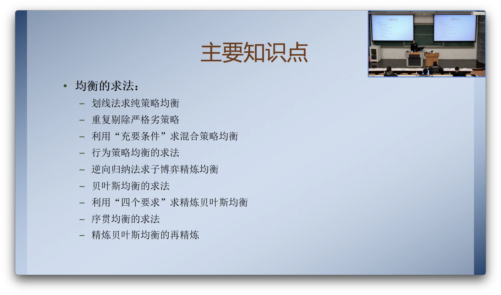
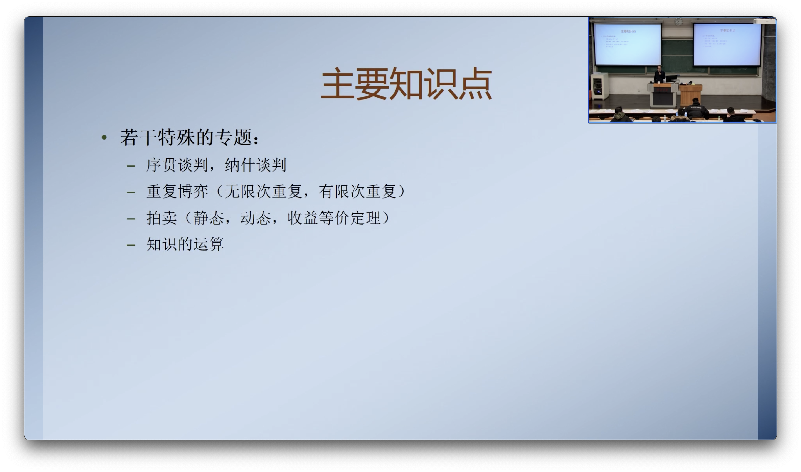
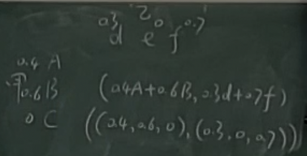
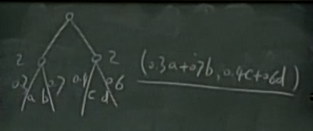

复习课总结：

1. 最大最小策略、最大最小值的求法

   是否是纯策略审题决定

2. 会采用重复剔除严格劣策略（或者弱劣策略）简化博弈

   同时注意严格劣策略不一定是严格劣于其它某个纯策略，也可以**<u>严格劣于某个混合策略</u>**，要“有一双慧眼”来发现这个严格优的混合策略

3. 采用划线法求纯策略纳什均衡

   可能是多人博弈

4. 利用“充要条件”求混合策略均衡

   一定要分情况讨论

5. 行为策略均衡的求法

   注意先使用逆向归纳法简化均衡，再转化为策略型表述使用划线法求纯策略均衡，再转化为行为策略

6. 采用逆向归纳法求子博弈精炼纳什均衡

7. 对于使用博弈树表示的博弈，会用策略型（双变量矩阵）将其重新表述，再使用划线法求纯策略均衡

8. 贝叶斯均衡的求法（第三讲）

   离散的情况：用策略型表述，计算每一种组合的期望收益，再使用划线法

   连续的情况：不完全信息的古诺博弈（作业类似的），写出效用函数，判断每个效用函数是否包含随机变量

9. 精炼贝叶斯均衡的求法

10. 不考拍卖和谈判

11. 五道题，不涉及命题的证明和名词解释，注意最后明确写出答案，均衡**<u>不是收益组合</u>**而是策略的组合

12. 预计一个半小时即可完成，难度比作业容易一些

静态博弈的两种策略表示方法：

动态博弈（行为策略）的策略表示方法：

大概率考的：

1. 有限重复博弈
2. 铁血谈判，注意不能使用逆向归纳法
3. 知识的运算

Points:

1. 扩展型表述、策略型表述、多代理人表述
