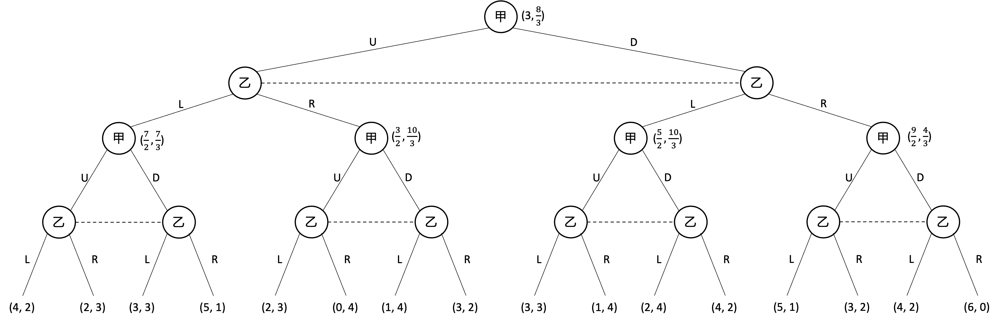

# 作业三

EmptyBlue

<i>Peking University</i>

**第1题（20分）**

**对于如下的两人动态博弈，求行为策略均衡：**

先写出这个动态博弈的混合策略表示：

由于从0点开始参与者1的两种情况等概率，因此对于参与者1的某种混合策略表示得到的两个效用具有相同的权值

| 参与者1\参与者2 | Meet             | Pass         |
| --------------- | ---------------- | ------------ |
| Raise, Raise    | 0, <u>0</u>      | <u>1</u>, -1 |
| Raise, Fold     | <u>0.5</u>, -0.5 | 0, <u>0</u>  |
| Fold, Raise     | -0.5, <u>0.5</u> | <u>1</u>, -1 |
| Fold, Fold      | 0, <u>0</u>      | 0, <u>0</u>  |

然后求这个博弈的纳什均衡

1. 这个博弈不存在纯策略纳什均衡

2. 枚举参与者2的情况，这个博弈不存在参与者1混合策略，参与者2纯策略纳什均衡

3. 枚举参与者1的情况，这个博弈不存在参与者2混合策略，参与者1纯策略纳什均衡

4. 参与者1和参与者2均混合策略：

   参与者1的 Fold, Fold 策略在参与者2为混合策略时必然是 Raise, Raise 策略的严格劣策略，因此可以忽略

   参与者1的 Fold, Raise 策略在参与者2为混合策略时必然是 Raise, Raise 策略的严格劣策略，因此可以忽略

   因此设参与者1的混合策略为 $(p, 1-p, 0, 0)$ ，参与者2的混合策略为 $(q,1-q)$

   
   $$
   \begin{aligned}
   &\mathbb E[\text{Raise, Raise}]=\mathbb E[\text{Raise, Fold}]\\
   \Rightarrow&1-q=\frac q2\\
   \Rightarrow&q=\frac 23
   \end{aligned}
   $$
   
   $$
   \begin{aligned}
   &\mathbb E[\text{Meet}]=\mathbb E[\text{Pass}]\\
   \Rightarrow&-\frac{1-q}{2}=-p\\
   \Rightarrow&p=\frac 13
   \end{aligned}
   $$
   因此 $(\frac 13, \frac 23, 0, 0)$ 和 $(\frac 23, \frac 13)$ 是这个博弈的一个混合策略纳什均衡

最后将混合策略表示的纳什均衡转化为行为策略：

对于参与者1的情况 $a$ ：必然选择 Raise 策略

对于参与者1的情况 $b$ ：选择 Raise 和 Fold 的策略为混合策略 $(\frac 13, \frac 23)$

对于参与者2的情况：选择 Meet 和Pass 的策略为混合策略 $(\frac 23, \frac 13)$

综上，这个动态博弈的纳什均衡的行为表述为：
$$
(([\text{Raise}],\frac 13[\text{Raise}]+\frac 23[\text{Fold}]),\frac 23[\text{Meet}]+\frac 13[\text{Pass}])
$$

**第2题（15分）**

**对于如下的两人动态博弈：**

**1、用双变量矩阵的形式表述该博弈，采用划线法求出纯策略纳什均衡。**

| 参与者1\参与者2 | AE                 | AF          | BE                 | BF                 |
| --------------- | ------------------ | ----------- | ------------------ | ------------------ |
| LC              | 1, <u>8</u>        | 1, 0        | <u>2</u>, 7        | <u>2</u>, 7        |
| LD              | 0, 1               | <u>9</u>, 0 | <u>2</u>, <u>7</u> | <u>2</u>, <u>7</u> |
| RC              | <u>2</u>, <u>0</u> | 2, <u>0</u> | <u>2</u>, <u>0</u> | <u>2</u>, <u>0</u> |
| RD              | <u>2</u>, <u>0</u> | 2, <u>0</u> | <u>2</u>, <u>0</u> | <u>2</u>, <u>0</u> |

简化后：

| 参与者1\参与者2 | AE                 | AF          | B                  |
| --------------- | ------------------ | ----------- | ------------------ |
| LC              | 1, <u>8</u>        | 1, 0        | <u>2</u>, 7        |
| LD              | 0, 1               | <u>9</u>, 0 | <u>2</u>, <u>7</u> |
| R               | <u>2</u>, <u>0</u> | 2, <u>0</u> | <u>2</u>, <u>0</u> |

这个动态博弈的纯策略纳什均衡的策略型表述（简化后）为：
$$
(LD,B)\\
(R,AE)\\
(R,B)
$$
这个动态博弈的纯策略纳什均衡的行为表述（简化后）为：
$$
((L, D),B)\\
(R,(A,E))\\
(R,B)\\
$$
**2、采用逆向归纳法求（纯策略）子博弈精炼纳什均衡。**

1. 1.2 和 2.2 的子博弈：纯策略纳什均衡是 $(C,E)$
3. 2.1选择A是最优反应
4. 1.1选择R是最优反应

因此这个动态博弈的纯策略纳什均衡的行为表述为：
$$
((R,C),(A,E))
$$

**第3题（15分）**

**阶段博弈（G）如下：**

**1、求阶段博弈 G 的纳什均衡（考虑纯策略和混合策略）。**

1. 采用划线法可知不存在纯策略纳什均衡

2. 设甲乙的混合策略为 $(p,1-p)$ 和 $(q,1-q)$
   $$
   \mathbb E[\mathrm U]=E[\mathrm D] \Rightarrow q=\frac 34\\
   \mathbb E[\mathrm L]=E[\mathrm R] \Rightarrow p=\frac 23\\
   $$
   从而混合策略纳什均衡为 $(\frac{2}{3}U+\frac{1}{3}D,\frac{3}{4}L+\frac{1}{4}R)$

   效用为 $(\frac 32, \frac 43)$

   

**2、画出重复博弈 G（2）的博弈树，并使用逆向归纳法求重复博弈 G（2）的子博弈精炼纳什均衡。**

考虑3、4阶段的四棵子博弈树：

1. 1、2阶段甲乙分别选择U、L指向的子博弈树：

   计算可得该子博弈有唯一的混合策略纳什均衡： $(\frac{2}{3}U+\frac{1}{3}D,\frac{3}{4}L+\frac{1}{4}R)$

   对应的效用为 $(\frac 72, \frac 73)$

2. 1、2阶段甲乙分别选择U、R指向的子博弈树：

   计算可得该子博弈有唯一的混合策略纳什均衡： $(\frac{2}{3}U+\frac{1}{3}D,\frac{3}{4}L+\frac{1}{4}R)$

   对应的效用为 $(\frac 32, \frac {10}3)$

3. 1、2阶段甲乙分别选择D、L指向的子博弈树：

   计算可得该子博弈有唯一的混合策略纳什均衡： $(\frac{2}{3}U+\frac{1}{3}D,\frac{3}{4}L+\frac{1}{4}R)$

   对应的效用为 $(\frac 52, \frac {10}3)$

4. 1、2阶段甲乙分别选择D、R指向的子博弈树：

   计算可得该子博弈有唯一的混合策略纳什均衡： $(\frac{2}{3}U+\frac{1}{3}D,\frac{3}{4}L+\frac{1}{4}R)$

   对应的效用为 $(\frac 92, \frac 43)$

   

考虑1、2阶段：

根据四个子博弈的均衡效用，1、2阶段的博弈可以描述为：

| 甲\乙 | L                       | R                       |
| ----- | ----------------------- | ----------------------- |
| U     | $\frac 72, \frac 73$    | $\frac 32, \frac {10}3$ |
| D     | $\frac 52, \frac {10}3$ | $\frac 92, \frac 43$    |

计算可得该博弈有唯一的混合策略纳什均衡： $(\frac{2}{3}U+\frac{1}{3}D,\frac{3}{4}L+\frac{1}{4}R)$

效用为 $(3, \frac 83)$ ，这就是两个博弈 $\mathrm G$ 的效用之和

综上， $\mathrm G(2)$ 的子博弈精炼纳什均衡的行为表述为：
$$
((\frac{2}{3}U+\frac{1}{3}D,\frac{2}{3}U+\frac{1}{3}D),(\frac{3}{4}L+\frac{1}{4}R,\frac{3}{4}L+\frac{1}{4}R))
$$
也即 $\mathrm G$ 的纳什均衡在每一阶段重复出现

**第4题（15分）**

**在由三个企业组成的寡头垄断市场中，市场反需求函数为 $p=a-q_1-q_2-q_3$ ， 其中 $q_i$ 为企业 $i$ 的产量， $a>0$。假设没有固定成本，每个企业的单位成本都为 $c$ ， 且 $c<a$ 。博弈分为两个阶段：**

**第一阶段，企业1与企业2同时决定各自的产量 $q_1$ ，和 $q_2$ ；**

**第二阶段，企业3在观察到企业1与企业2的产量后再决定自己的产量 $q_3$ 。**

**求此博弈的（纯策略）子博弈精炼纳什均衡。**

采用逆向归纳法：

首先考虑企业3的单节点信息集子博弈：

企业3的效用函数：
$$
\pi_3=q_3(a-q_1-q_2-q_3-c)
$$
企业3最大化效用：
$$
\frac{\partial \pi_3}{\partial q_3}=-2q_3+a-q_1-q_2-c=0\Rightarrow q_3=\frac{a-q_1-q_2-c}2
$$

然后考虑企业1与企业2的博弈：

企业1、2的效用函数：
$$
\pi_1=q_1(a-q_1-q_2-q_3-c)=\frac{q_1(a-q_1-q_2-c)}2\\
\pi_2=q_2(a-q_1-q_2-q_3-c)=\frac{q_2(a-q_1-q_2-c)}2
$$
企业1、2最大化效用：
$$
\frac{\partial \pi_1}{\partial q_1}=\frac{a-2q_1-q_2-c}{2}=0\\
\frac{\partial \pi_2}{\partial q_2}=\frac{a-q_1-2q_2-c}{2}=0\\
$$
解得：
$$
q_1=q_2=\frac{a-c}3
$$
此时有：
$$
q_3=\frac{a-c}6
$$
综上，这个博弈的纯策略子博弈精炼纳什均衡的行为表述为：
$$
(\frac{a-c}3,\frac{a-c}3,\frac{a-c}6)
$$

**第5题（15分）**

**阶段博弈（G）如下：**

**考虑无限次重复博弈，采用冷酷策略构造一个子博弈精炼纳什均衡，使得甲 、乙双方在每个阶段都会选择“不内卷”。贴现因子 $\delta$ 需要满足什么条件？**

一直采用不内卷的效用：
$$
\mathrm U=\sum_{i=0}^\infin{8\delta^i}=\frac8{1-\delta}
$$
在第 $\mathrm k=0$ 期开始内卷的效用：
$$
\mathrm U_0=9+\sum_{i=1}^\infin{3\delta^i}=9+\frac{3\delta}{1-\delta}
$$
在第 $\mathrm k>0$ 期开始内卷的效用：
$$
\mathrm U_k=\sum_{i=0}^{k-1}{8\delta^i}+9\delta^k+\sum_{i=k+1}^\infin{3\delta^i}=8 \frac{1-\delta^k}{1-\delta}+9\delta^k+3\frac{\delta^{k+1}}{1-\delta}=\frac{8+\delta^k-6\delta^{k+1}}{1-\delta}
$$
在 $\delta \in (0,\frac16)$ 时，$\mathrm U_0>\mathrm U_1$ ，在 $\delta \in (\frac16,1)$ 时，$\mathrm U_0<\mathrm U_1$ 

1. $\delta \in (0,\frac16)$ 

   比较可得， $\mathrm U_0>\mathrm U_1>\mathrm U_2>\cdots>\mathrm U_n>\cdots$
   $$
   \begin{aligned}
   &\mathrm U>\mathrm U_0\\
   \Leftarrow&\frac8{1-\delta}>9+\frac{3\delta}{1-\delta}\\
   \Leftarrow&\delta>\frac 16
   \end{aligned}
   $$

2. $\delta \in (\frac16,1)$ 

   比较可得， $\mathrm U_0<\mathrm U_1<\mathrm U_2<\cdots<\mathrm U_n<\cdots\sim\mathrm U$

综上， $\delta\in(\frac16,1)$

接下来需要证明如果两个人都采取冷酷策略，当 $\delta$ 满足上述条件的时候，每个阶段都不内卷是一个子博弈精炼纳什均衡

在根结点的时候，不内卷对双方是一个纳什均衡，没有人有偏离这个均衡开始内卷的动机，因为上述运算已经证明了不内卷的效用更高

考虑根结点以下的任意一个子博弈树，由于这个博弈是无穷的，那么这个子树与从根结点开始的博弈树是一样的，从而这个子树也是纳什均衡的

根据子博弈精炼纳什均衡的定义，这个博弈整体是一个子博弈精炼纳什均衡

**第6题（20分）**

**假设一个工会垄断了劳动力供给，考虑该工会与 $n$ 个寡头垄断企业之间的博弈 ，博弈时序如下：**

**第一阶段：工会首先确定单一的工资水平 $\omega$ ，适用于所有企业。**

**第二阶段： $n$ 个企业得知 $\omega$ ，然后同时选择各自雇佣的人数 $L_i$ ，$i=1,\cdots,n$ 。**

**工会的收益为 $(\omega-\omega_0)\sum_{i=1}^nL_i$ ，其中 $\omega_0$ 为正的带数，代表工会成员到另外行业谋职可取得的收入。**

**假设企业 $i$ 的产量为 $q_i=kL_i$ ，其中 $k$ 为正的常数：市场反需求函数为 $p=a-\sum_{i=1}^nq_i$ ，其中 $a>0$ ；企业除工资支出以外没有其他成本。**

**1、求纯策略子博弈精炼纳什均衡。**

先考虑第二阶段：

寡头企业效用函数：
$$
\pi_i=pq_i-\omega L_i=q_i(a-\sum_{i=1}^nq_i)-\frac{\omega q_i}{k}
$$
效用最大化：
$$
\frac{\partial \pi_i}{\partial q_i}=0
$$
计算可得：
$$
q_1=q_2=\cdots=q_n
$$
从而有：
$$
L_1=L_2=\cdots=L_n=\frac{ka-\omega}{k^2(n+1)}
$$

再考虑第一阶段：

工会效用函数：
$$
\pi=-\frac{n}{k^2(n+1)}(\omega-\omega_0)(\omega-ka)
$$
根据二次函数对称性：
$$
\omega=\frac{\omega_0+ka}{2}
$$

综上，这个博弈的纳什均衡的行为表述为：
$$
(\omega=\frac{\omega_0+ka}{2},L_1=\frac{ka-\omega}{k^2(n+1)},L_2=\frac{ka-\omega}{k^2(n+1)},\cdots,L_n=\frac{ka-\omega}{k^2(n+1)})
$$

**2、企业数量 $n$ 如何影响工会的均衡收入?**
$$
\pi=\frac{1}{k^2(1+\frac 1n)}\left(\frac{ka-\omega_0}{2}\right)^2
$$
$n \uparrow$ ，工会均衡收入 $\pi \uparrow$

$n \downarrow$ ，工会均衡收入 $\pi \downarrow$

**3、参数 $k$ 的大小如何影响工会的均衡收入?**
$$
\pi=\frac{1}{4(1+\frac 1n)}\left(a-\frac{\omega_0}{k}\right)^2
$$
$k \uparrow$ ，工会均衡收入 $\pi \uparrow$

$k \downarrow$ ，工会均衡收入 $\pi \downarrow$

