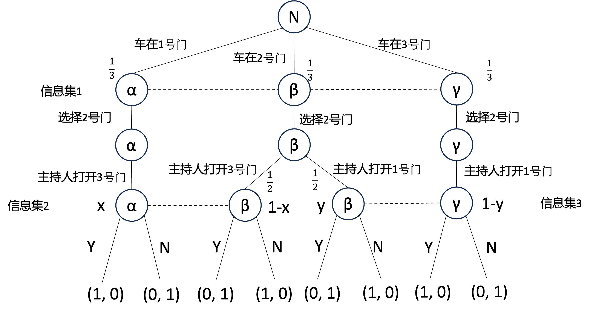

# 作业五

EmptyBlue

<i>Peking University</i>

**第1题（20分）**

**考虑一个完全但不完美信息博弈：**

**（1）用策略型表述该博弈，并求出纯策略纳什均衡。**

策略型表述：

| 参与者1\参与者2 | L'          | M'                 | R'          |
| --------------- | ----------- | ------------------ | ----------- |
| L               | 1, <u>3</u> | 1, 2               | <u>4</u>, 0 |
| M               | <u>4</u>, 0 | 0, 2               | 3, <u>3</u> |
| R               | 2, <u>4</u> | <u>2</u>, <u>4</u> | 2, <u>4</u> |

纯策略纳什均衡为 （R，M'）

**（2）求精炼贝叶斯均衡。**

设参与者 2 对自己在信息集中的信念为 $[p,1-p]$

对参与者2的策略情况分类计算可得：

① $p\in(\frac23,1]$ 时参与者2选择 L'

此时参与者1必然选择 M ，这与参与者2的信念矛盾，舍去

② $p=\frac23$ 时参与者2选择 L' 与 M' 的混合策略 $x[L']+(1-x)[M']$

此时参与者1选择三个策略的效用分别为 $(1, 4x,2)$ ，只要 $x\in(0,\frac12)$ ，参与者1就会选择 R，就可以与参与者2的信念不矛盾，因为此时参与者2的信念没有被约束

③ $p\in(\frac13,\frac23)$ 时参与者2选择 M'

此时参与者1必然选择 R，与参与者2的信念不矛盾，因为此时参与者2的信念没有被约束

④ $p=\frac13$ 时参与者2选择 M' 与 R' 的混合策略 $x[M']+(1-x)[R']$

此时参与者1选择三个策略的效用分别为 $(4-3x, 3-3x,2)$ ，只要 $x\in(\frac23,1)$ ，参与者1就会选择 R，就可以与参与者2的信念不矛盾，因为此时参与者2的信念没有被约束

⑤ $p\in[0,\frac13)$ 时参与者2选择 R'

此时参与者1必然选择 L，这与参与者2的信念矛盾，舍去

综上所述，共有三个精炼贝叶斯均衡，分别是：

①
$$
([R],x[L']+(1-x)[M'])\\
x\in(0,\frac12)\\
p=\frac 23
$$
②
$$
([R],[M'])\\
p\in[\frac13,\frac23]
$$
③
$$
([R],x[M']+(1-x)[R'])\\
x\in(\frac23,1)\\
p=\frac13
$$

**第2题（20分）**

**考虑Monty Hall游戏：一位嘉宾面对三扇门，其中一扇门后有一辆特斯拉汽车，另外两扇门后空空如也。 主持人知道每扇门后是否有车， 但嘉宾不知道。 如果嘉宾能够猜中哪扇门后有车，这部车就奖励给嘉宾。游戏步骤为：**

**首先，嘉宾猜选一扇门；**

**随后，主持人从另外两扇门中选择一扇空门打开；**

**最后，嘉宾决定是否改猜另一扇门。**

**请你画出博弈树， 并求精炼贝叶斯均衡。（提示：为简单起见，仅考虑嘉宾初始猜选2号门的情况。对于其他情况的分析类似。）**

参与者的第一个信息集中，他的信念应当是相等的，所以都是 $\frac 13$

如果参与者选中了正确的门，主持人应当以相等的概率选择另外两扇没有车的门中的一扇门，这应当是共同知识

在这个条件下可以利用贝叶斯法则确定信息集2，3中的信念： $x=\frac23,y=\frac13$

由于参与者是序贯理性的，他应当在每个信息集中选择效用最大的策略，计算可得信息集2，3中均应选策略 $[Y]$ ，也就是更换门

综上，精炼贝叶斯均衡为 $[选择二号门，Y]$ ，信息集1的信念为 $(\frac13,\frac13,\frac13)$ ，信息集2的信念为 $(\frac23,\frac13)$ ，信息集3的信念为 $(\frac13,\frac23)$

**第3题（20分）**

**考虑如下的信号博弈：**

**（1）求纯策略均衡。**

参与者1和参与者2均有两个信息集，参与者1有四种纯策略，参与者2有两种纯策略，

| 参与者1\参与者2 | ua         | da         |
| --------------- | ---------- | ---------- |
| LL              | (1, 1.5)   | (0, 0.5)   |
| LR              | (1.5, 2)   | (0.5, 1.5) |
| RL              | (0.5, 2.5) | (0.5, 2)   |
| RR              | (1, 3)     | (1, 3)     |

对于参与者1来说，此时 LL 和 RL 是严格劣策略，重复剔除严格劣策略后采用划线法可以得到这个博弈的纯策略均衡为：
$$
([LR],[ua])\\
([RR],[da])\\
$$

**（2）求纯策略精炼贝叶斯均衡（考虑分离均衡和混同均衡）。**

设参与者2对处于信息集中的信念为 $(x,1-x)$ 和 $(y, 1-y)$ ，

**<u>分离均衡：</u>**

第一类分离均衡策略 $[LR]$ ：

那么 $x=1,y=0$ ，

参与者2序贯理性，因此参与者2策略为 $[ua]$

参与者1序贯理性，在参与者2策略为 $[ua]$ 的情况下，参与者1的策略 $[LR]$ 确实满足序贯理性

**<u>因此策略 $([LR],[ua])$ 与信念 $x=1,y=0$ 可以作为精炼贝叶斯均衡</u>**

第二类分离均衡策略 $[RL]$ ：

那么 $x=0,y=1$ ，

参与者2序贯理性，因此参与者2策略为 $[ua]$

参与者1序贯理性，在参与者2策略为 $[ua]$ 的情况下，参与者1的策略 $[RL]$ 不满足序贯理性，序贯理性的解应当是 $[LR]$ 

该策略不是精炼贝叶斯均衡

**<u>混同均衡：</u>**

第一类混同均衡策略 $[LL]$ ：

那么 $x=\frac 12,y\in[0,1]$ ，

参与者2序贯理性，因此参与者2策略为 $[ua]$

参与者1序贯理性，在参与者2策略为 $[ua]$ 的情况下，参与者1的策略 $[LL]$ 不满足序贯理性，序贯理性的解应当是 $[LR]$ 

该策略不是精炼贝叶斯均衡

第二类混同均衡策略 $[RR]$ ：

那么 $x\in[0,1],y=\frac 12$ ，

参与者2序贯理性，并且 u 是 d 的占优策略，因此参与者2策略为 $[ua]$

参与者1序贯理性，在参与者2策略为 $[ua]$ 的情况下，参与者1的策略 $[LL]$ 不满足序贯理性，序贯理性的解应当是 $[LR]$ 

该策略不是精炼贝叶斯均衡

**第4题（20分）**

**一个民事诉讼博弈的时序如下：**

**首先，原告（参与者1）提出索赔 $m_1 = 1$ 或 $m_2=2$ 。**

**其次，被告表态。 如果被告接受原告的索赔， 就按要求赔偿原告，博弈结束；如果被告拒绝原告的索赔，案件就由法院来判决。**

**如果原告胜诉，原告收益为 3 ，被告收益为 -4 ；如果原告败诉，原告收益为 -1 ，被告收益为 0 。假设原告能够准确预见自己能否胜诉，但被告只知道原告胜诉的概率为 $\frac 13$ 。以上信息是双方的共同知识。**

**请你画出博弈树，并求纯策略精炼贝叶斯均衡（考虑分离均衡和混同均衡）。**

第一类分离均衡 $[m_1m_2]$

那么 $x=1,y=0$ ，

参与者2序贯理性，因此参与者2策略为 $[AD]$

参与者1序贯理性，在参与者2策略为 $[AD]$ 的情况下，参与者1的策略 $[m_1m_2]$ 不满足序贯理性，序贯理性的解应当是 $[m_2m_1]$

因此该策略不是精炼贝叶斯均衡

第二类分离均衡 $[m_2m_1]$

那么 $x=0,y=1$ ，

参与者2序贯理性，因此参与者2策略为 $[DA]$

参与者1序贯理性，在参与者2策略为 $[DA]$ 的情况下，参与者1的策略 $[m_2m_1]$ 不满足序贯理性，序贯理性的解应当是 $[m_1m_2]$

因此该策略不是精炼贝叶斯均衡

第一类混同均衡 $[m_1m_1]$ ：

那么 $x=\frac 13,y\in[0,1]$ ，

参与者2序贯理性，因此参与者2策略为 $[AA]$ 或 $[AD]$

参与者1序贯理性，因此需要 W 和 L 的情况下对于参与者1都是 $m_1$ 的效用更高，但是无论参与者2的策略是 $[AA]$ 还是 $[AD]$ ，W 的情况下都是 $m_2$ 的效用更高

因此该策略不是精炼贝叶斯均衡

第二类混同均衡 $[m_2m_2]$ ：

那么 $x\in[0,1],y=\frac 13$ ，

参与者2序贯理性，因此参与者2策略为 $[AD]$ 或 $[DD]$

参与者1序贯理性，因此需要 W 和 L 的情况下对于参与者1都是 $m_2$ 的效用更高，所以参与者2的策略一定要是 $[DD]$ ，否则参与者2在 L 的情况下就应该选 $m_1$ 了

计算可得，$x\in[0,\frac 14]$ 的情况下参与者2可以选择 $[DD]$ 作为自己的策略

因此策略 $([m_2m_2],[DD])$ 与信念 $x\in[0,\frac14],y=\frac13$ 可以作为精炼贝叶斯均衡

**第5题（20分）**

**考虑如下一个买家与一个卖家之间的博弈：**

**一个卖家要出售一件物品， 该物品对于卖家来说价值为 0 ，对买家来说价值为 $v$ 。其中 $v$ 在 $[0,1]$ 上均匀分布， $v$ 的值是买家的私人信息。博弈分为两轮：**

**第一轮： 卖家出价 $p_0$ ；若买家接受则成交，卖家和买家的收益分别是 $p_0$ 和 $v-p_0$ ，博弈结束；若买家不接受，则进行第二轮。**

**第二轮：卖家出价 $p_1$ ；若买家接受则成交，卖家和买家的收益分别是 $\delta p_1$ 和 $\delta(v-p_1)$ ，博弈结束，其中 $\delta\in(0,1)$ 为折现因子；若买家不接受，则双方收益均为 0 ，博弈结束。**

**求这个博弈的精炼贝叶斯均衡（提示：买家的策略可以用 $f$ 和 $g$ 两个函数表示，在第一轮接受交易当且仅当 $v\geqslant f(p_0)$，在第二轮接受交易当且仅当 $v\geqslant g(p_1)$ ）。**

分析这个博弈，参与者1（卖家）由于不知道买家的私人价值，他的第一层有一个信息集，第二层有无穷多个信息集，分别代表他的两次出价；参与者2（买家）由于知道自己的私人价格，他的所有信息集都是单节点的。

根据已知，参与者1对于 $v$ 的信念是 $U(0,1)$ ，那么可以确定参与者1的第一个信息集上的信念是均匀分布的；根据贝叶斯法则，可以确定参与者1在第二层的每一个信息集上的信念对于在均衡路径上的节点也是均匀分布的。

考虑买家在第二次选择中是序贯理性的：

买家在第二轮接受交易当且仅当 $v\geqslant p_1$ ，这也就是函数 $g$

考虑卖家在第二次选择中是序贯理性的：

对于任意一个 $p_0$ ，可以计算出卖家在第二层对应的信息集上每个策略对应的期望效用：

其中 $v\geqslant p_1$ 才有效用，否则就是 0；并且 $f(p_0)\geqslant v$ 才会进入第二层博弈，否则卖家对于这个节点的信念就是 0，不用算效用了
$$
\pi_{v}=\int_0^1\delta p_1\mathbb I_{f(p_0)\geqslant v\geqslant p_1}\mathrm dv=\int_{p_1}^{f(p_0)}\delta p_1\mathrm dv=\delta p_1(f(p_0)-p_1)
$$
由于卖家是序贯理性的，他必然选择这个信息集上的策略 $p_1=\frac {f(p_0)}2$ 

考虑买家在第一次选择中是序贯理性的：

根据卖家在第二次选择中的出价，买家面临两种情况，

① $\frac 12 f(p_0)>v$

此时在第二次选择中不会成交，买家的收益为 0

此时由于 $v<\frac 12 f(p_0)$ ，在第一次出价中必然不成交，这也与卖家在第二层的信息集中的信念大于 0 相吻合

② $\frac 12 f(p_0)\leqslant v$

此时在第二次选择中会成交，买家的收益为 $\delta[v-\frac12 f(p_0)]$

若要买家的选择与卖家在第二层的信息集中的信念相吻合，也即卖家在第二层博弈对于 $v\geqslant f(p_0)$ 的节点信念是 0 ，需要在 $v=f(p_0)$ 的时候恰好成交，也就是在 $v=f(p_0)$ 的时候买家在第一层做抉择的时候是否成交的期望收益相同， $v-f(p_0)=\delta [v-p_1]$ ，计算可得：
$$
f(p_0)=\frac{2p_0}{2-\delta}
$$

考虑卖家在第一次选择中是序贯理性的：

在 $v\in[\frac 12f(p_0),f(p_0)]$ 的时候在第二次选择成交，卖家效用为 $\frac \delta2f(p_0)$ 

在 $v\in[f(p_0),1]$ 的时候在第一次成交，卖家效用为 $p_0$ 

计算出卖家在第一层信息集上每个策略对应的期望效用：
$$
\pi=\int_{\frac 12f(p_0)}^{f(p_0)}\frac \delta2f(p_0)\mathrm dv+\int_{f(p_0)}^1p_0\mathrm dv=\frac{3\delta-4}{(2-\delta)^2}p_0^2+p_0
$$
由于卖家是序贯理性的，他必然选择这个信息集上的策略 $p_0=\frac{(2-\delta)^2}{2(4-3\delta)}$ 

综上所述，这个精炼贝叶斯均衡为：

$p_0=\frac{(2-\delta)^2}{2(4-3\delta)}$ 

买家在第一轮在 $v\geqslant f(p_0)=\frac{2-\delta}{4-3\delta}$ 时成交

$p_1=\frac{2-\delta}{2(4-3\delta)}$

买家在第二轮在 $v\geqslant g(p_1)=p_1=\frac{2-\delta}{2(4-3\delta)}$ 时成交

其中卖家在第一次出价的信息集上的信念是 $U(0,1)$ ，在第二次出价的所有信息集上的信念为 $U(0,f(p_0))$ 
