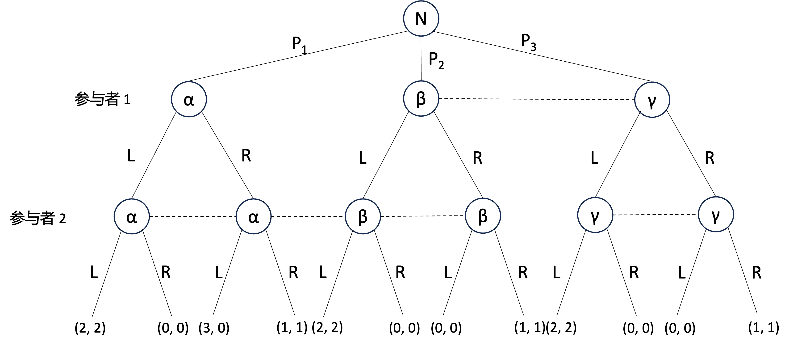

# **作业四**

EmptyBlue

<i>Peking University</i>

**第 1 题（20分）**

**考虑下面的二人不完全信息博弈：**

1. **用博弈树表述该博弈（提示：使用海萨尼转换）。**

   首先考虑参与者 1，如图所示：

   

   根据参与者 1 对世界状态的先验概率分布，有：
   $$
   P_2:P_3=3:1
   $$
   

   然后考虑参与者 2 ，如图所示：

   

   根据参与者 2 对世界状态的先验概率分布，有：
   $$
   P_1:P_2=3:1
   $$
   再根据 $P_1+P_2+P_3=1$ ，解得：
   $$
   \begin{cases}
   P_1=\frac{9}{13}\\
   P_2=\frac{3}{13}\\
   P_3=\frac{1}{13}
   \end{cases}
   $$
   该博弈的博弈树形式表述为（三种情况的概率分布如上所述）：

   

   

2. **根据博弈树，用策略型表述该博弈，并求出所有纯策略纳什均衡。**

   参与者 1 的策略集为：
   $$
   \{LL,LR,RL,RR\}
   $$
   参与者 2 的策略集同样为：
   $$
   \{LL,LR,RL,RR\}
   $$
   计算可得这个博弈的策略型表述为：

   | 参与者 1 \ 参与者 2 | LL                                                    | LR                                                     | RL                                                     | RR                                       |
   | ------------------- | ----------------------------------------------------- | ------------------------------------------------------ | ------------------------------------------------------ | ---------------------------------------- |
   | LL                  | $(2, \underline 2)$                                   | $\left(\frac{24}{13},\frac{24}{13}\right)$             | $\left(\frac{2}{13},\frac{2}{13}\right)$               | $(0,0)$                                  |
   | LR                  | $\left(\frac{18}{13},\frac{18}{13}\right)$            | $\left(\frac{19}{13},\underline{\frac{19}{13}}\right)$ | $\left(\frac{3}{13},\frac{3}{13}\right)$               | $\left(\frac{4}{13},\frac{4}{13}\right)$ |
   | RL                  | $\left(\underline{\frac{35}{13}},\frac{8}{13}\right)$ | $\left(\underline{\frac{33}{13}},\frac{6}{13}\right)$  | $\left(\frac{11}{13},\underline{\frac{11}{13}}\right)$ | $\left(\frac{9}{13},\frac{9}{13}\right)$ |
   | RR                  | $\left(\frac{27}{13},0\right)$                        | $\left(\frac{28}{13},\frac{1}{13}\right)$              | $\left(\underline{\frac{12}{13}},\frac{12}{13}\right)$ | $(\underline{1},\underline{1})$          |

   使用划线法可以得出这个博弈有唯一的纯策略纳什均衡：
   $$
   (RR,RR)
   $$
   

**第 2 题（20分）**

**考虑如下的二人博弈：**

**显然，状态集合为 $Y=\{\alpha, \beta, \gamma, \delta\}$ 。**

**从收益函数看, 状态 $\beta, \gamma, \delta$ 是相同的，但状态 $\alpha$ 不同于状态 $\beta, \gamma, \delta$, 差异在于参与者 1 对应于行动组合 $(R, L)$ 的收益是 3 还是 0 。**

**将事件 $A$ 定义为 “参与者 1 对应于行动组合 $(R, L)$ 的收益是 0 ” ，亦即**
$$
A=\{\beta, \gamma, \delta\}
$$
1. **写出每个参与者的信息分割。**

   状态集合为 $Y=\{\alpha, \beta, \gamma, \delta\}$

   参与者 1 的信息分割为：
   $$
   \Gamma_1=\{\{\alpha\},\{\beta,\gamma\},\{\delta\}\}
   $$
   参与者 2 的信息分割为：
   $$
   \Gamma_2=\{\{\alpha,\beta\},\{\gamma,\delta\}\}
   $$

2. **依据知识算子 $K$ 的定义, 计算 $K_1 A 、 K_2 K_1 A 、 K_1 K_2 K_1 A 、 K_2 K_1 K_2 K_1 A$ 。**
   $$
   K_1A=\{\beta, \gamma, \delta\}
   $$

   $$
   K_2K_1A=\{\gamma,\delta\}
   $$

   $$
   K_1 K_2 K_1 A=\{\delta\}
   $$

   $$
   K_2K_1 K_2 K_1 A=\varnothing
   $$

   

**第 3 题（20分）**

**企业 1 和企业 2 同时决定是否进入某市场，各自进入成本为 $c_i \in[0,5], i=1,2, c_i$是企业 $i$ 的私人信息。企业 $i$ 相信对手的成本 $c_j$ 在区间 $[0,5]$ 上服从均匀分布。如果只有一个企业 $i$ 进入市场, 其收益为 $10-c_i$ ；如果两个企业都进入市场, 那么各自的收益为 $3-c_i$；不进入市场的企业收益为 0 。**

**求此博弈的纳什均衡。**

对于每一个参与者（如果加入自然节点），他会有 $[0,5]\approx\aleph$  这么多的信息集，每个信息集有两种选择（进入或者不进入市场），那么如果使用策略型表述，这个参与者将会有 $2^\aleph$ （从 $[0,5]$ 映射到 $\{0,1\}$ 的函数数量）这么多的纯策略，无法分析。

但是对于每一个参与者，考虑 $c_i$ 从 0 逐渐增大的过程，如果他从进入市场（最开始成本为 0 必然进入）变为了不进入市场，他就不会在 $c_i$ 更大的时候再次进入市场，因为成本变高了，再次进入市场会导致期望效用小于 0 。

在这个假设下，每个参与者就会只剩下一种纯策略：在成本小于临界成本的时候进入市场，在成本大于等于临界成本的时候退出市场。

| 企业 1 \ 企业 2 | 进入市场        | 不进入市场   |
| --------------- | --------------- | ------------ |
| 进入市场        | $(3-c_1,3-c_2)$ | $(10-c_1,0)$ |
| 不进入市场      | $(0,10-c_2)$    | $(0,0)$      |

假设这个临界成本对于两个企业来说分别为 $t_1$ 和 $t_2$ ，那么这个只有一个纯策略的博弈的期望效用为：
$$
\left(\int_0^{t_1}\frac{t_2}{5}(3-c_1)+\left(1-\frac{t_2}5\right)(10-c_1)\mathrm dc_1,\int_0^{t_2}\frac{t_1}{5}(3-c_2)+\left(1-\frac{t_1}5\right)(10-c_2)\mathrm dc_2\right)
$$
企业 1 和企业 2 想让自己的期望效用最大，其中变量是 $t_1$ 和 $t_2$ ，那么让两个式子分别对 $t_1$ 和 $t_2$ 求导得 0 ，有如下两个式子：
$$
\begin{cases}
\frac{t_2}{5}(3-t_1)+\left(1-\frac{t_2}5\right)(10-t_1)=0\\
\frac{t_1}{5}(3-t_2)+\left(1-\frac{t_1}5\right)(10-t_2)=0
\end{cases}
$$
解得：
$$
t_1=t_2=\frac{25}6
$$
从而这个博弈的纳什均衡是每个企业在自己的成本小于 $\frac{25}6$ 的时候进入市场，在自己的成本大于等于$\frac{25}6$ 的时候不进入市场

**第 4 题（20分）**

**考虑具有独立私人价值物品的密封拍卖问题：**

**假设有 $n>1$ 个潜在的买方参与竞标，物品对于每个买方的私人价值相互独立，且服从区间 $[0,1]$ 上的均匀分布。出价最高者中标，并按照最高报价与第二高报价的平均值向卖方支付。假设所有买方都是风险中性的， 求参与者在对称均衡中的出价策略。**

考虑使用收益等价定理，利用最高价密封拍卖的期望支出公式，两者期望支出相等可以得到：
$$
\begin{aligned}
(1-\frac 1n)v_i^n&=\mathbb E[\text{cost}_i]\\
&=\mathrm{Pr}[\text{bidder i wins}]\mathbb E[\text{cost}_i|\text{bidder i wins}]\\
&=v_i^{n-1}\mathbb E[\text{cost}_i|\text{bidder i wins}]\\
\end{aligned}
$$
从而有：
$$
\mathbb E[\text{cost}_i|\text{bidder i wins}]=(1-\frac 1n)v_i
$$
假设第 $i$ 个买方竞价成功，他的报价为 $b_i$ ，计算竞价成功条件下的期望支出：

设随机变量 $X$ 代表他的条件支出，随机变量 $Y$ 代表次高价格，由于出价函数是私人价值的线性函数（**<u>假设的条件</u>**），那么出价同样服从均匀分布，也即 $Y\sim\mathrm U(0,b_i)$ ，从而有：
$$
\begin{aligned}
\mathrm F(x)&=\mathrm{Pr}(X<x)\\
&=\mathrm{Pr}(\frac{Y+b_i}2<x)\\
&=\mathrm{Pr}(Y<2x-b_i)\\
&=
\begin{cases}
\left(\frac{2x-b_i}{b_i}\right)^{n-1}\ \ \ \ x\geqslant\frac{b_i}2\\
0\ \ \ \ 0\leqslant x\leqslant\frac{b_i}2\\
\end{cases}
\end{aligned}
$$
计算期望支出：
$$
\begin{aligned}
\mathbb E[\text{cost}_i|\text{bidder i wins}]&=\int_0^{b_i}xf(x)\mathrm dx\\
&=\int_{\frac{b_i}2}^{b_i}xf(x)\mathrm dx\\
&=\int_{\frac{b_i}2}^{b_i}x\mathrm{dF}(x)\\
&=x\mathrm{F}(x)\bigg|_{\frac{b_i}2}^{b_i}-\int_{\frac{b_i}2}^{b_i}\mathrm{F}(x)\mathrm dx\\
&=(1-\frac 1{2n})b_i
\end{aligned}
$$
代入竞价成功条件下的期望支出满足的方程，得到均衡出价策略：
$$
b_i=\frac{2n-2}{2n-1}v_i
$$

**<u>如果我们不知道出价函数是私人价值的线性函数，可以如下方法求解：</u>**

考虑使用收益等价定理，利用最高价密封拍卖的期望支出公式，两者期望支出相等可以得到：
$$
\begin{aligned}
(1-\frac 1n)v_i^n&=\mathbb E[\text{cost}_i]\\
&=\mathrm{Pr}[\text{bidder i wins}]\mathbb E[\text{cost}_i|\text{bidder i wins}]\\
&=v_i^{n-1}\mathbb E[\text{cost}_i|\text{bidder i wins}]\\
\end{aligned}
$$
在 $v_i$ 为最高出价的条件下，设随机变量 $X$ 代表第二高出价，从而有：
$$
\begin{aligned}
(1-\frac 1n)v_i&=\mathbb E[\text{cost}_i|\text{bidder i wins}]\\
&=\mathbb E_{X\sim \mathrm U(0,v_i)}[\frac{\beta(v_i)+\beta(X)}2]\\
&=\frac{1}2\beta(v_i)+\frac{1}2\mathbb E[\beta(X)]\\
\end{aligned}
$$
$X$ 的概率分布：
$$
\begin{aligned}
\mathrm F(X=x)&=\mathrm{Pr}(X<x)\\
&=\left(\frac{x}{v_i}\right)^{n-1}\\
\end{aligned}
\Rightarrow
\mathrm f(X=x)=(n-1)\frac{x^{n-2}}{v_i^{n-1}}\\
$$
然后计算 $\beta(X)$ 的期望：
$$
\begin{aligned}
\mathbb E[\beta(X)]&=\int_0^{v_i}\beta(x)f(x)\mathrm dx\\
&=\int_{0}^{v_i}\beta(x)(n-1)\frac{x^{n-2}}{v_i^{n-1}}\mathrm dx\\
\end{aligned}
$$
从而有：
$$
\frac{1}2\beta(v_i)+\frac{1}2\int_{0}^{v_i}\beta(x)(n-1)\frac{x^{n-2}}{v_i^{n-1}}\mathrm dx=(1-\frac 1n)v_i\\
\Rightarrow
\beta(v_i)v_i^{n-1}+\int_{0}^{v_i}\beta(x)(n-1)x^{n-2}\mathrm dx=2(1-\frac 1n)v_i^{n}
$$
对 $v_i$ 求导并化简：
$$
v_i\frac{\mathrm d\beta(v_i)}{\mathrm dv_i}=-2(n-1)\beta(v_i)+2(n-1)v_i
$$
使用常数变异法解之得：
$$
\beta(v_i)=\left(\frac{2n-2}{2n-1}v_i^{2n-1}+C\right)v_i^{2-2n}
$$

出价函数需要在 $[0,1]$ 上有界，所以 $C=0$  ，得到均衡出价策略：
$$
b_i=\frac{2n-2}{2n-1}v_i
$$

**第 5 题 （20分）**

**考虑两个企业生产差异化产品的情形。假定市场对两个企业的产品需求函数分别如下所示:**
$$
\begin{aligned}
& q_1=a-b p_1+d p_2 \\
& q_2=a-b p_2+d p_1
\end{aligned}
$$

**其中, $0<d<b$ 。**

**假设两个企业都没有固定成本，且单位生产成本为常数。假设企业 2 的单位生产成本 $\mathrm{C}_2$ 是双方的共同知识。企业 1 的单位生产成本 $\mathrm{C}_1$ 有两种可能的类型一高成本 $\mathrm{C}_{\mathrm{H}}$与低成本 $\mathrm{C}_{\mathrm{L}}$ ，企业 2 只知道企业 1 具有高成本的概率为 $\theta$ ，具有低成本的概率为 $1-\theta$ ，而企业 1 知道自己的成本。**

**以上信息是双方的共同知识。两个企业同时定价，求此定价博弈的纯策略纳什均衡。**

考虑企业 1 ，企业 1 知道企业 2 的生产成本，从而 $p_2$ 对企业 1 来说不是随机变量:
$$
\begin{aligned}
\pi_1&=q_1(p_1-\mathrm {c_1})\\
&=(\mathrm a-\mathrm b p_1+\mathrm d p_2)(p_1-\mathrm {c_1})
\end{aligned}
$$
企业 1 进行效用最大化：
$$
\begin{aligned}
&\frac{\partial \pi_1}{\partial p_1}=\mathrm a-2\mathrm bp_1+\mathrm dp_2+\mathrm{bc_1}=0\\
\Rightarrow&p_1=\frac{\mathrm a+\mathrm dp_2+\mathrm{bc_1}}{2\mathrm b}
\end{aligned}
$$

考虑企业 2 ，企业 2 只知道企业 1 的生产成本的概率分布，从而 $p_1$ 对企业 2 来说是随机变量：
$$
\begin{aligned}
\pi_2&=q_2(p_2-\mathrm {c_2})\\
&=(\mathrm a-\mathrm b p_2+\mathrm d \mathbb E[p_1])(p_2-\mathrm {c_2})
\end{aligned}
$$
企业 2 进行效用最大化：
$$
\begin{aligned}
&\frac{\partial \pi_2}{\partial p_2}=\mathrm a-2\mathrm bp_2+\mathrm d\mathbb E[p_1]+\mathrm{bc_2}=0\\
\Rightarrow&p_2=\frac{\mathrm a+\mathrm d\mathbb E[p_1]+\mathrm{bc_2}}{2\mathrm b}
\end{aligned}
$$
由于企业 2 知道企业 1 的定价方法，可以化简上式：
$$
\begin{aligned}
p_2&=\frac{\mathrm a+\mathrm d\mathbb E[p_1]+\mathrm{bc_2}}{2\mathrm b}\\
&=\frac{\mathrm{d^2}p_2+\mathrm{bd}\mathbb E[c_1]+\mathrm{2b^2}c_2+\mathrm{2ab+ad}}{\mathrm{4b^2}}
\end{aligned}
$$
这个式子左右均有 $p_2$ ，解得：
$$
\begin{aligned}
p_2&=\frac{\mathrm{bd}\mathbb E[c_1]+\mathrm{2b^2}c_2+\mathrm{2ab+ad}}{\mathrm{4b^2-d^2}}\\
&=\frac{\mathrm{bd[\theta C_H+(1-\theta) C_L]}+\mathrm{2b^2}c_2+\mathrm{2ab+ad}}{\mathrm{4b^2-d^2}}
\end{aligned}
$$

由于企业 1 知道企业 2 的上述定价方法，可以化简 $p_1$ 的结果：
$$
\begin{aligned}
p_1&=\frac{\mathrm a+\mathrm dp_2+\mathrm{bc_1}}{2\mathrm b}\\
&=\frac{\mathrm a+\mathrm d\frac{\mathrm{bd[\theta C_H+(1-\theta) C_L)]}+\mathrm{2b^2}c_2+\mathrm{2ab+ad}}{\mathrm{4b^2-d^2}}+\mathrm{bc_1}}{2\mathrm b}\\
&=\frac{\mathrm{b(2b+d)(2b-d)}c_1+\mathrm{2b^2d}c_2+\mathrm{bd^2[\theta C_H+(1-\theta) C_L]+\mathrm{4ab^2+2abd}}}{\mathrm{2b(2b+d)(2b-d)}}
\end{aligned}
$$

综上所述，这个博弈的纯策略纳什均衡为：
$$
\begin{cases}
p_1=\frac{\mathrm{b(2b+d)(2b-d)}c_1+\mathrm{2b^2d}c_2+\mathrm{bd^2[\theta C_H+(1-\theta) C_L]+\mathrm{4ab^2+2abd}}}{\mathrm{2b(2b+d)(2b-d)}}\\
p_2=\frac{\mathrm{bd[\theta C_H+(1-\theta) C_L]}+\mathrm{2b^2}c_2+\mathrm{2ab+ad}}{\mathrm{4b^2-d^2}}
\end{cases}
$$
其中 $c_1$ 根据企业 1 的真实的成本（不同的世界状态）取 $\mathrm C_H$ 或 $\mathrm C_L$ 
